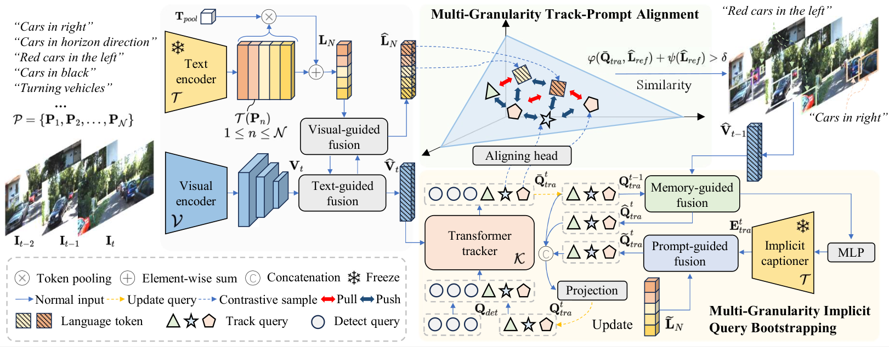

# MGLT

The official PyTorch implementation of the paper "Multi-granularity Localization Transformer with Collaborative Understanding for Referring Multi-Object Tracking".

Referring Multi-Object Tracking (RMOT) involves localizing and tracking specific objects in video frames by utilizing linguistic prompts as references. 
To enhance the effectiveness of linguistic prompts when training, 
we introduce a novel Multi-Granularity Localization Transformer with collaborative understanding, termed MGLT. 
Unlike previous methods focused on visual-language fusion and post-processing, 
MGLT reevaluates RMOT by preventing linguistic clues attenuation during propagation and poor collaborative localization ability.
MGLT comprises two key components: Multi-Granularity Implicit Query Bootstrapping (MGIQB) and Multi-Granularity Track-Prompt Alignment (MGTPA). 
MGIQB ensures that tracking and linguistic features are preserved in later layers of network propagation by bootstrapping the model to generate text-relevant and temporal-enhanced track queries. \revised{Simultaneously, MGTPA with multi-granularity linguistic prompts enhances the model's localization ability by understanding the relative positions of different referred objects within a frame.} Extensive experiments on well-recognized benchmarks demonstrate that MGLT achieves state-of-the-art performance. 
Notably, it shows significant improvements on Refer-KITTI dataset of 2.73%, 7.95% and 3.18% in HOTA, AssA, and IDF1, respectively. 


## Framework

<div align=center></div>


## Preparation

Preparing data for [Refer-KITTI](https://github.com/wudongming97/RMOT) and [Refer-BDD](https://github.com/lab206/EchoTrack).

Before training, please download the pretrained weights from [Deformable DETR](https://github.com/fundamentalvision/Deformable-DETR) and [CLIP-R50](https://openaipublic.azureedge.net/clip/models/afeb0e10f9e5a86da6080e35cf09123aca3b358a0c3e3b6c78a7b63bc04b6762/RN50.pt).

Then organizing project as follows:

~~~
├── refer-kitti
│   ├── KITTI
│           ├── training
│           ├── labels_with_ids
│   └── expression
├── refer-bdd
│   ├── BDD
│           ├── training
│           ├── labels_with_ids
│           ├── expression
├── weights
│   ├── r50_deformable_detr_plus_iterative_bbox_refinement-checkpoint.pth
│   ├── RN50.pt
...
~~~

## Training

To do training of MGLT with 4 GPUs, run:

```bash 
sh configs/r50_rmot_train.sh
```

## Testing

To do evaluation of MGLT with 1 GPU, run:

```bash
sh configs/r50_rmot_test.sh
```


## Result

The main results of MGLT:

| **Method** |                     **Dataset**                     | **HOTA** | **DetA** | **AssA** | **DetRe** | **DetPr** | **AssRe** | **AssRr** | **LocA** | **MOTA** | **IDFI** | **IDS** |                                        **URL**                                         |
|:----------:|:---------------------------------------------------:|:--------:|:--------:|:--------:|:---------:|:---------:|:---------:|-----------|----------|----------|----------|---------|:--------------------------------------------------------------------------------------:|
|    MGLT    | [Refer-KITTI](https://github.com/wudongming97/RMOT) |  49.25   |  37.09   |  65.50   |   49.28   |   58.72   |   69.88   | 88.23     | 91.10    | 21.13    | 55.91    | 2442    | [model](https://drive.google.com/drive/folders/1m1vPOeAw__Q6BRZ0tAKa0DmYXmkO4czk?usp=sharing) |
|    MGLT    | [Refer-BDD](https://github.com/lab206/EchoTrack)    |  40.26   |  28.44   |  57.59   |   37.24   |   52.48   |   63.52   | 81.87     | 86.98    | 11.68    | 44.41    | 12935    | [model](https://drive.google.com/drive/folders/1m1vPOeAw__Q6BRZ0tAKa0DmYXmkO4czk?usp=sharing) |

## License

This project is under the MIT license. See [LICENSE](https://github.com/JiajunChern/MGLT/blob/main/LICENSE) for details.

## Update

- 2024.5.8 Release code and checkpoint.

- 2024.3.25 Init repository.


## Acknowledgements

Our project is based on [RMOT](https://github.com/wudongming97/RMOT) and 
[CO-MOT](https://github.com/BingfengYan/CO-MOT). Many thanks to these excellence works.

